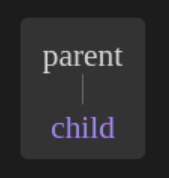
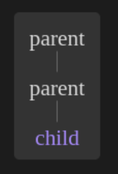
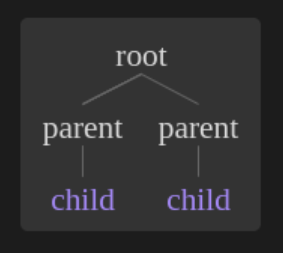

# Syntax tree generator

this project is a port of [syntree](https://github.com/mshang/syntree) (also known as [https://mshang.ca/syntree/](https://mshang.ca/syntree/)) to an obsidian plugin.

## how to use

Simply write your syntax tree in labelled bracket notation, and sourround it by three ticks (`) above and below, alongside the "syntree" indicator, like in the following example :

## features

add a node : `[parent child]`

use nesting : `[parent [parent child]]`

add multiple child nodes : `[root [parent child] [parent child]]`

add a triangle : `[parent^ child]`

add a triangle : `[parent^ child]`

add a silent head : `[root \0]`

use brackets in node names : `[root {child}]`
