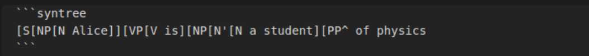
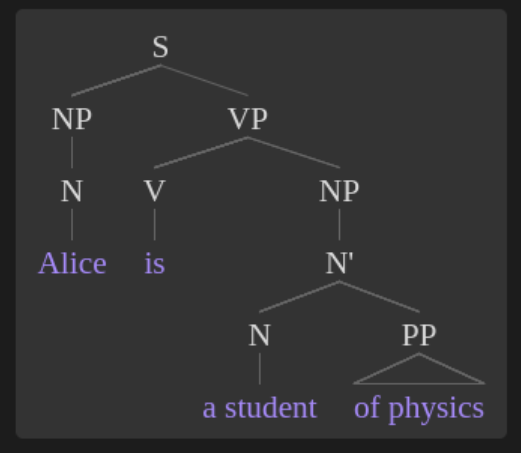
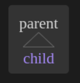
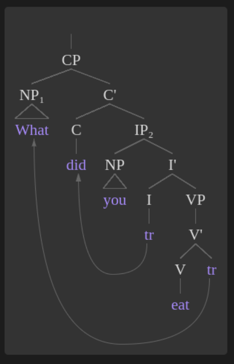
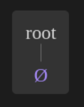
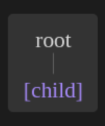
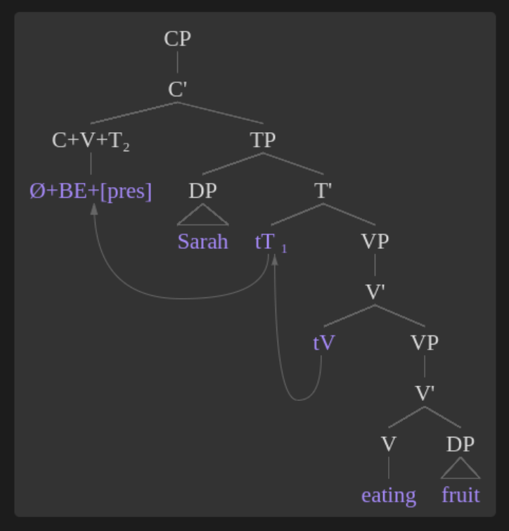

# Syntax tree generator

this project is a port of [syntree](https://github.com/mshang/syntree) (also known as [https://mshang.ca/syntree/](https://mshang.ca/syntree/)) to an obsidian plugin.


## how to use

Simply write your syntax tree in labelled bracket notation, and sourround it by three ticks (`) above and below, alongside the "syntree" indicator, like in the following example :




## Labelled bracket notation

Your basic constituent looks like this: [X Y]

X is the category label. Y represents the content. X can be any string of Unicode characters, not including square brackets or spaces. Typical examples might include NP, N', and N. The content Y is any string of Unicode characters, including spaces. The app looks for the first space to determine where X ends and Y begins. In addition, Y can contain any number of other constituents, which should also be given in labelled bracket notation. Here are a few examples:

`[ [NP Alice] ]` --- X is NP, Y is Alice.

`[ [NP [N Alice] and [N Bob] ] ]` --- Here, there are three constituents. The whole string is one constituent, with X = NP and Y = "[N Alice] and [N Bob]". Another constituent is [N Alice], with X = N and Y = Alice. The final constituent is [N Bob], with X = N and Y = Bob.

### Triangles

Often, in linguistics, if you don't want to fully flesh out a tree, you indicate this with a triangle. In order to draw triangles with this app, include a caret ^ anywhere in the category label X. This indicates that a triangle should be drawn between the present node and any of its children, i.e. between the category label and the content.

example: `[parent^ child]`


### Movement lines and subscripts

This app has basic support for drawing movement lines. To show movement, mark the head of the movement with an underscore followed by a tag after the category label (e.g.  `[X_a Y]`). Mark the tail with the same tag between angled brackets (e.g. `[W tr<a>]`). The head constituent can not be an ancestor of the tail. Tags can only consist of letters and numbers. Tags that consist of only numbers will appear in subscript after the category label. In other words, if NP_1 is a category label, it will appear as NP<sub>1</sub>.

Example: `[CP [NP^_1 What] [C' [C_b did] [IP_2 [NP^ you] [I' [I tr<b>] [VP [V' [V eat] tr<1>]]]]]]`


Although subscripts are technically only allowed in category labels, you can cheat by creating a constituent with no content, like this: `[NP [PRO_1]]`. This tricks the app into thinking that PRO is a category label, but in the resulting tree, it will look like content with a subscript. However, this only works if the "fake label" is only one word. Otherwise, it will be split up into label and content at the first space.

### terminal lines

there is an option to enable or disable terminal lines. The term "terminal node" refers to an element of the tree that doesn't have any children. Any other node is a "non-terminal node."
On: Terminal nodes are treated exactly the same as non-terminals with respect to placement and line drawing.
Off: Terminal nodes are placed on a new line after their parents, and no lines will be drawn between them.
This option only affects terminal nodes that have no siblings. Otherwise, it would look silly. Also, it does not affect terminal nodes that have triangles drawn to them.

### misc quality of life features


add a silent head : `[root \0]`


use brackets in node names : `[root {child}]`


you can even use space and intendations in your labelled bracket notation

```syntree
[CP [C'
	[C+V+T_2 \0+BE+{pres}]
	[TP
		[DP^ Sarah]
		[T'
			tT<2>_1
			[VP [V'
				tV<1>
				[VP
					[V'
						[V eating]
						[DP^ fruit]
					]
				]
			]]
		]
	]
]]
```
becomes
